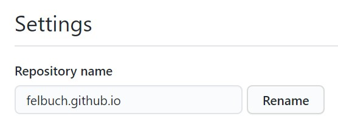

Making a website is super easy! As long as you have the right tools. The tool I used to build this site is called **Jekyll**

### Why Jekyll?

I'll be brutally honest here: Simply because **it's easy!**  
It doesn't require installing packages, configuring virtual environments,... it's pretty much ready to use!  
All you need to do is follow the yellow brick road:

### Step 1: Have a GitHub account

You need a GitHub account.


GitHub allows you to host a [static website](https://en.wikipedia.org/wiki/Static_web_page).
This means you can have your own website in GitHub.  
But it's static, so it cannot have any applications the user interacts with.
Still, that's a very small price to pay for such an easy way to make a website.

If you don't have a GitHub account, you can create one [here] (https://github.com/).  
I won't go on the details on how to set up a GitHub account here, but if you need help doing that, you can probably find it in this [tutorial](https://git-scm.com/book/en/v2/Getting-Started-Installing-Git).

### Step 2: Fork the Beautiful Jekyll repository

One you have your GitHub account set up, go the the [Beautifull Jekyll repository](https://github.com/daattali/beautiful-jekyll). You should see something like the picture below. Notice the **Fork** button, on the upper right corner. You need to click it!


When you click the Fork button, you're actually creating a copy of Beautiful Jekyll for youself. This will be the your website. Sure, you'll make changes to it. But the essential structure is already there.

This is a bit like using a template for a school project. You won't simply copy someone elses project. But it helps to have a file that's already properly formatted, so you can just change the content.

Let's begin by changing the most important thing of all:

### Step 3: Change the repository name. This will be your website address!

Once you've forked the Beautifull Jekyll repository, it should appear as a repository in your own GitHub.
You'll see a Setting button. Click on it.


This will take you to a screen where you will be able to change the name of this repository:

  

This will also be your website's URL, so take a minute to think about how you would like to name it...  
Since your name is also a URL (and since it will be hosted on GitHub), your name must have the form **whatever_you_like.github.io**. Darth Vader, for example, could name his website *Death_Star.github.io*, or *Proud_Jedi_Dad.github.io*.


### Step 4: Customizing your website

You'll notice that the Beautiful Jekyll package comes with many files. One of them is called **_config.yml**.  

This file configures your website's structure.
It has lots of stuff in it, but it's easy to understand if you just give it a try.

So open it. 
Look where it has a LinkedIn address and change it for your own.  
Do the same with the Facebook address and e-mail.  
If you don't want to show any information, just comment the entire line.  

Just open the file and go through it, changing whatever needs to be changed.      
You'll be fine, I promise!  

### You have a website!

Once you've commited the changes you made to the *_config.yml* file, you can pat yourself on the back and celebrate: You now have a website!  


"But wait!", you'll say.  
"Where are my posts? My pictures? All the content I want there to be in my website?"  

### Step 5: Your first blog post

Among all the files and folders you forked from Beautiful Jekyll, you'll find a folder names **_posts**.  

A post is simply a markdown file.  
It's a markdown file that follows 3 rules:
1. It starts with a date
2. It ends with `.md`
3. Spaces are represented by a short dasth: `-`

Want an example to make things clearer?
The file you're reading right now is called **2020-08-25-How-to-make-your-own-website.md**.

In summary:

> Write a file in markdown, name it correctly, drop it in the **\_posts** folder, and there you have it: your own blog post!  

Need a refresher in Markdown? There's awesome material out there, but why not [start with this one](https://guides.github.com/features/mastering-markdown/#intro)?  

Don't miss the section on adding pictures to a markdown document.  
Your blog will definitely need some pictures!
But you'll need to put these images into a folder.  
I put mine on the **assets** folder, inside the **img** subfolder.  

### Step 6: Own and make it your own

Beautiful Jekyll comes with a number of default files.  
The *_posts* folder has two default posts, for example.
You won't want these files in your website, so just go ahead and delete them.  

Beautiful Jekyll comes with a running default version of a website.
It's a good website, but it's not *your* website.  
It's just for illustration purposes.  
So change whatever you like.  
Keep whatever you like.  
Write your own content, and let your website come to life!


```python

```
